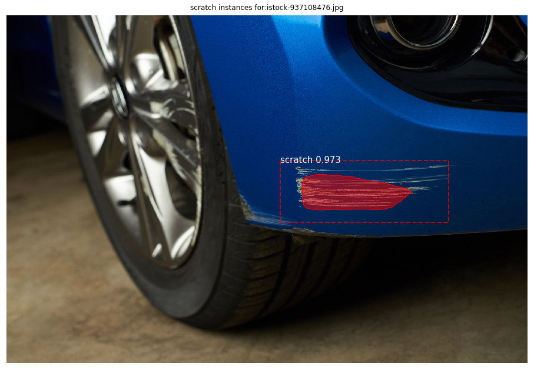

# Scratch detection on car using Mask R-CNN

This repository detects instances of scratches on a car and encompasses it with a polygonal boundry.
#### sources:
+ Matterport: https://github.com/matterport/Mask_RCNN/releases/
+ Splash: https://github.com/matterport/Mask_RCNN/tree/master/samples/balloon
+ https://github.com/nitsourish/car-damage-detection-using-CNN

### Logical Steps
1. Clone the repository from `matterport` with the implementation of `Mask R-CNN` algorithm.
2. Generate appropriate dataset with annotations using http://www.robots.ox.ac.uk/~vgg/software/via/via.html or a
 downloaded offline program, http://www.robots.ox.ac.uk/~vgg/software/via/downloads/via-2.0.10.zip
2. Train using the `COCO` weights. This will generate models at checkpoint intervals; we are interested in the last
 checkpointed model.
3. Detect object and `splash` color. This will generate the image with desired object splashed with color.

### Execution Steps
1. Training: 
    ```bash
    python maskR_CNN.py train --dataset=data/ --weights=coco
    ```

Automated car damage detection using Instance Segmentation(Mask R-CNN)

image ID: scratch.image53.jpeg (2)  
```text
Processing 1 images
image                    shape: (1024, 1024, 3)       min:    0.00000  max:  255.00000  uint8
molded_images            shape: (1, 1024, 1024, 3)    min: -123.70000  max:  151.10000  float64
image_metas              shape: (1, 14)               min:    0.00000  max: 1024.00000  int32
anchors                  shape: (1, 261888, 4)        min:   -0.35390  max:    1.29134  float32
gt_class_id              shape: (2,)                  min:    1.00000  max:    1.00000  int32
gt_bbox                  shape: (2, 4)                min:  315.00000  max:  728.00000  int32
gt_mask                  shape: (1024, 1024, 2)       min:    0.00000  max:    1.00000  bool
The car has:2 damages

```
### Result


### Insight
#### Area covered:
```text
Image size: w=2119 h=1415 mask PIxels:50043 area=0.016689984775137282
Single pix area:8.404524435654528e-05
Total area:4.205876163334596
```
## Deployment

create a SageMaker notebook with GPU capabilities to train the model.
Training is performed as follows,

### Training:
```python
python mrcnn_training.py --dataset=data/
```
The generated model will be uploaded to s3://cip.models/segmentation/scratch/<scratch_dir> folder
Eventually, this model after verification should be uploaded to the `latest/` folder under the bucket.
